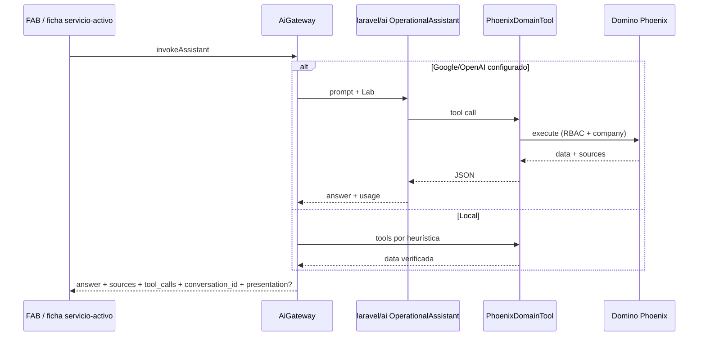

# AI Gateway — Phoenix

La IA es un servicio transversal. Nunca se invoca un proveedor desde dominio de negocio.

## Responsabilidades

- Seleccionar proveedor (`AiProviderContract`: OpenAI / Local)
- Prompts versionados (`PromptTemplate`)
- Tool registry interno de **solo lectura** (`AiToolRegistry`)
- Cuotas (`AiQuotaService`) y auditoría (`AiInvocation` + `tool_calls`)
- Orquestación del asistente (tool-calling o grounding local)

## Tools v2 (read-only)

| Tool | Uso |
|------|-----|
| `list_recent_routines` | Servicios recientes |
| `get_routine` | Detalle por ID |
| `list_audit_entries` | Auditoría |
| `search_assets` | Activos por tag |
| `list_supply_items` | Insumos |
| `list_clients` | Clientes |
| `list_invoices` | Facturas |
| `list_sites` | Sitios |
| `get_operational_kpis` | KPIs agregados (dashboard) |

Todas filtran por `company_id` y respetan permisos del rol. No hay tools de escritura.

## Presentación dashboard

Cuando la pregunta pide KPIs/dashboard, el gateway adjunta `presentation` determinística (`AssistantDashboardBuilder`) — no inventada por el LLM:

```json
{ "type": "dashboard", "title": "KPIs operativos", "content": { "layout": { "columns": 12 }, "charts": [] } }
```

## UX

- Chat operativo: FAB global (no hay página Insights de chat).
- Narrativa / costo: panel en ficha de servicio.
- OCR placa + sugerencias de insumos: formularios de activos.
- APIs `/insights/*` se mantienen; el permiso sigue siendo `insights.use`.

## Historial

- Con Laravel AI: `RemembersConversations` + `conversation_id` persistido.
- Local: `conversation_id` + `history` del cliente para continuidad de intención.

## Flujo asistente



## Proveedores

- Plataforma elige: `local` | `google` | `openai` (`Configuración → Asistente IA`)
- Al seleccionar proveedor se valida la API key y se listan modelos (`GET /platform/ai/models`)
- Modelo: selección del listado o “usar por defecto” (`GEMINI_MODEL` / `OPENAI_MODEL`)
- Runtime: `laravel/ai` (`Lab::Gemini` / `Lab::OpenAI`)
- Keys: `GEMINI_API_KEY` o `GOOGLE_API_KEY`, `OPENAI_API_KEY`

Adapters caseros (`OpenAiProvider` / `GoogleProvider`) quedan para OCR/gramática legacy hasta migrarlos al SDK.

## Referencia externa

Patrones inspirados en MCP TXA + ai-assistant gateway (tool loop, grounding). Implementación **adaptada** a Laravel monolito Phoenix — sin servidor MCP Python en v2.

Ver changes [043](../archive/043-ai-gateway-tool-registry/proposal.md), [044](../archive/044-laravel-ai-sdk-gateway/proposal.md) y [045](../archive/045-assistant-v3-history-kpis/proposal.md).
