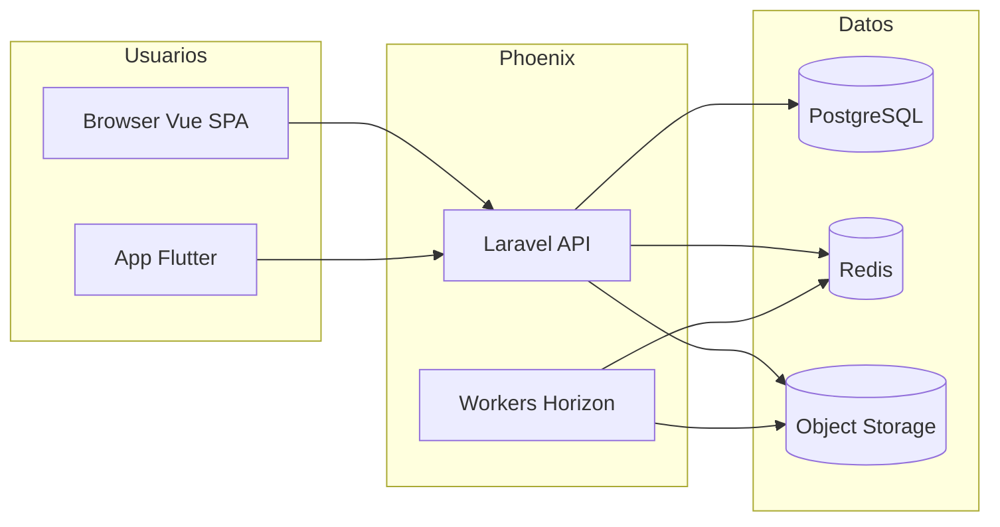

# Arquitectura — Phoenix

## Estilo

- **Monolito modular** en un despliegue Laravel (ADR-001).
- **DDD táctico** por módulos / bounded contexts.
- **Event-driven** para efectos secundarios (reportes, notificaciones, facturación).
- **Metadata-driven** para formularios, reportes y workflows (ADR-006).

## Vista de contenedores

## Módulos lógicos

Ver [modules.md](modules.md). Regla: un módulo no importa modelos Eloquent de otro; usar **application services**, **DTOs** y **eventos**.

## API

- REST JSON para web y móvil.
- Autenticación: tokens (Sanctum o equivalente) + políticas por permiso.
- Endpoint de sync dedicado en fase móvil ([mobile-sync.md](mobile-sync.md)).
- Versionado de API documentado en `api-design.md` (pendiente al iniciar código).

## Persistencia

- PostgreSQL relacional + **JSONB** para definiciones de formulario, plantillas y workflow.
- Redis: cache, sesiones, colas.
- Archivos binarios solo en object storage ([storage.md](storage.md)).

## Procesamiento asíncrono

- Generación PDF, llamadas IA, envío de correo, procesamiento post-sync → colas.
- Jobs idempotentes donde aplique (sync, facturación).

## Seguridad

- Permisos granulares; políticas por empresa (tenant).
- AI Gateway valida permiso antes de invocar modelo.
- Ver [security.md](security.md) (resumen).

## Relación con diseño

La arquitectura de información de la UI está en [../design/information-architecture.md](../design/information-architecture.md); no duplica módulos backend pero debe mapearse 1:1 en navegación admin.

## Estado

Documento de **diseño**; sin código en repositorio aún. Las ADRs concretan decisiones.

## Diagramas

- [Contenedores](../diagrams/containers.md)
- [Capas](../diagrams/layered-architecture.md)
- [Mapa de módulos](../diagrams/module-map.md)
