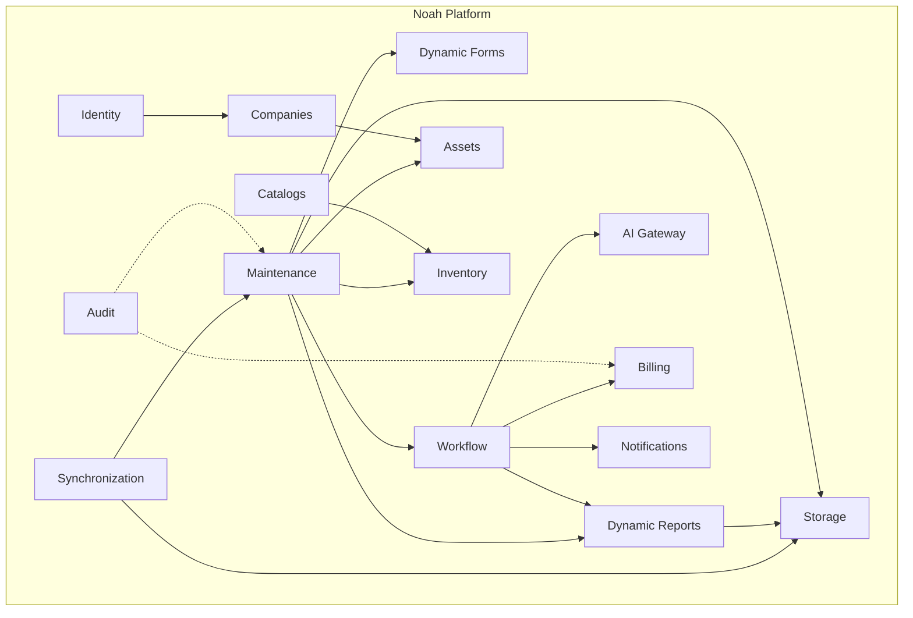
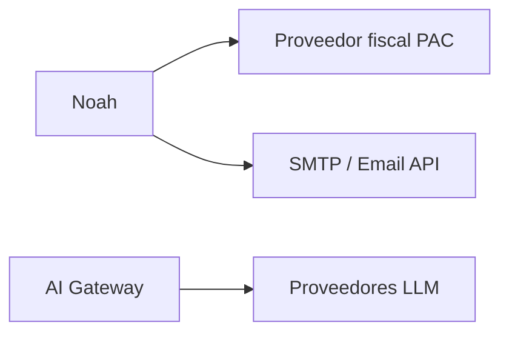

# Mapa de contexto — Noah

**Lectura:** Maintenance orquesta la operación; consume Forms y Reports; Workflow coordina IA, Billing y Notifications. Sync y Storage son transversales.

## Integraciones externas (futuro)

Ninguna integración externa es obligatoria para el MVP web excepto almacenamiento y (opcional) SMTP.
