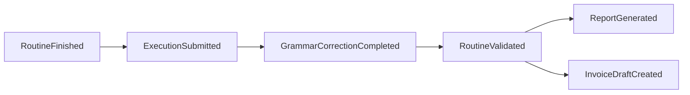

# Eventos de dominio — Noah

Eventos nombrados en pasado; payload mínimo e inmutable. Los consumidores deben ser idempotentes.

## Mantenimiento y ejecución

| Evento | Cuándo | Consumidores típicos |
|--------|--------|----------------------|
| `RoutineCreated` | Se crea una rutina | Notifications, Audit |
| `RoutineAssigned` | Se asigna técnico | Notifications |
| `RoutineStarted` | Inicio de ejecución | Audit |
| `RoutineFinished` | Técnico marca fin en campo/web | Workflow, Sync |
| `ExecutionSubmitted` | Datos de formulario enviados | Workflow, AI Gateway |
| `EvidenceUploaded` | Archivo registrado en storage | Report Engine (preview), Audit |
| `RoutineValidated` | Supervisor aprueba | Billing, Report generation |
| `RoutineRejected` | Supervisor rechaza | Notifications |

## Documentos

| Evento | Cuándo | Consumidores |
|--------|--------|--------------|
| `ReportGenerationRequested` | Workflow pide PDF | Report Engine (async) |
| `ReportGenerated` | PDF listo | Notifications, Storage |
| `GrammarCorrectionCompleted` | IA devolvió texto | Maintenance (actualiza campo), Audit |

## Facturación

| Evento | Cuándo | Consumidores |
|--------|--------|--------------|
| `InvoiceDraftCreated` | Borrador desde rutina validada | UI Facturación |
| `InvoiceIssued` | Emisión fiscal o comercial | Audit, Notifications |
| `InvoiceCancelled` | Cancelación | Audit |

## Plataforma

| Evento | Cuándo | Consumidores |
|--------|--------|--------------|
| `FormVersionPublished` | Nueva versión de formulario | Sync (catálogo a móvil) |
| `ReportTemplatePublished` | Nueva plantilla | Cache, Audit |
| `SynchronizationCompleted` | Lote sync OK | Audit, UI |

## Flujo ejemplo (validación → reporte → factura)

Los pasos exactos los define el **Workflow Engine**, no código fijo en Maintenance.

## Bus de eventos

En Laravel: eventos de dominio + listeners en cola; evitar cadenas síncronas largas en request HTTP.
