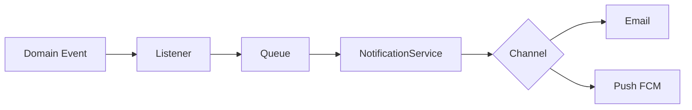

# Notification Engine — Phoenix

Dominio: [notifications.md](../domain/notifications.md).

## Arquitectura



## Canales

| Canal | Fase |
|-------|------|
| Email | v1 |
| Push móvil (FCM) | v2 — ver [ADR-014](../decisions/ADR-014-mobile-push-fcm.md) y cambio 047 |
| WhatsApp / SMS | futuro |
| Slack / Teams | integraciones |

## Push (v2)

- Registro: `POST /api/v1/mobile/device-tokens`
- Envío: `App\Services\Notifications\PushNotifier` (cola Redis)
- Drivers: `log` (local/tests) | `fcm` (HTTP v1)

## Interfaz

```php
// Conceptual
interface NotificationChannel {
    public function send(NotificationMessage $message): void;
}
```

## Plantillas

- Variables sustituidas en cola, no en request HTTP.
- Versionado de plantillas opcional (v1: una plantilla por tipo de evento).

## Reintentos

- 3 reintentos exponenciales; dead-letter para revisión admin.
