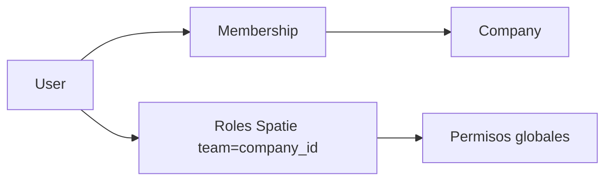

# 018 — Mantenedor de usuarios, roles y permisos (por empresa)

## Problema

- La pantalla **Administración → Usuarios** es solo lectura; el administrador no puede asignar roles ni dar de baja membresías.
- Los roles viven en un **enum** (`MembershipRole`) en `company_memberships.role`; la autorización se repite con middleware `company.role:*` y comprobaciones ad hoc en controladores.
- El dominio ([identity.md](../../domain/identity.md)) y [target-users.md](../../vision/target-users.md) ya describen **permisos nombrados** (`catalog.manage`, `routines.validate`, …), pero no hay catálogo ni evaluación unificada en código.
- Sin un modelo escalable, cada módulo nuevo añade otra rama `if (role === …)` y aumenta el riesgo de inconsistencia UI/API.

## Objetivo

1. **Mantenedor web** accesible solo con rol **Administrador** en la empresa activa (`X-Company-Id`).
2. Gestionar **membresías**: listar usuarios de la empresa, cambiar rol, activar/desactivar acceso (sin borrar historial).
3. Gestionar **roles y permisos** de forma **multi-tenant**: lo que aplica en la empresa A no filtra a la empresa B.
4. Unificar autorización en backend (y reflejar capacidades en frontend) con un catálogo de permisos alineado al glosario.

## Recomendación técnica (roles y permisos)

### Opción elegida: **Spatie Laravel Permission** con **teams** (`company_id`)

| Criterio | Enum + middleware actual | RBAC propio en tablas | **Spatie + teams** |
|----------|--------------------------|------------------------|---------------------|
| Multi-empresa | Manual por `CurrentCompany` | Hay que diseñarlo | **Nativo** (`team_foreign_key = company_id`) |
| Catálogo de permisos | Disperso | Control total | **Tablas + seeders** |
| Policies / Gates | Parcial | Sí | **`$user->can()` en contexto team** |
| Caché de permisos | No | Manual | **Incluido** |
| Roles personalizados por cliente | No | Sí (costoso) | **Sí (fase 2)** |
| Curva de adopción | Ya existe | Alta | Media; migración desde enum |

**Por qué no quedarse solo en el enum:** válido para el MVP inicial, pero el producto ya define **más de cinco roles** y **~12 permisos**; el mantenedor pedido implica mostrar y eventualmente ajustar qué puede hacer cada rol. Spatie evita reinventar pivotes, caché, y convenciones que el equipo ya conoce en Laravel.

**Por qué no un RBAC 100 % custom sin paquete:** Noah es monolito modular con prioridad en dominio correcto; Spatie no acopla bounded contexts si se limita al módulo **Identity** (servicio `CompanyAuthorization`, middleware propio). El paquete es infraestructura, no dominio de rutinas/facturación.

### Modelo conceptual (por empresa)

- **Permisos**: catálogo **global** (mismos slugs en todas las empresas), definidos en código + tabla `permissions` (seed). Ejemplos: `catalog.manage`, `billing.settings`, `company.users.manage`.
- **Roles del sistema (plantillas)**: Administrador, Supervisor, Técnico, Facturación, Auditor — seeded por empresa al crear la compañía (o al primer acceso admin).
- **Membresía**: un usuario tiene **un rol principal** en la UI v1 (selector); internamente puede ser un solo rol Spatie por team para simplificar. Fase posterior: varios roles si negocio lo pide.
- **Evaluación**: `Gate::before` o middleware `company.permission:billing.settings` que fija el team Spatie al `CurrentCompany` antes de `authorize`.

### Mapeo desde el estado actual

| `MembershipRole` (enum) | Rol Spatie (team) | Permisos (resumen, ver matriz en target-users) |
|-------------------------|-------------------|-----------------------------------------------|
| `administrator` | Administrator | Todos los de operación + diseño + `company.users.manage` |
| `supervisor` | Supervisor | Rutinas asignar/validar, costos, catálogo limitado |
| `technician` | Technician | Ejecutar rutinas |
| `billing` | Billing | Facturación + settings |
| `auditor` | Auditor | Solo lectura auditoría |

Migración: script que, por cada `company_memberships` activa, asigna el rol Spatie equivalente en el team `company_id`. Mantener columna `role` enum **temporalmente** (dual-write) una versión; luego deprecar y leer solo Spatie.

### Alternativas descartadas (por ahora)

- **Solo policies Laravel sin tabla de permisos:** no escala al mantenedor “ver/editar permisos por rol”.
- **Casbin / políticas ABAC:** potente para reglas dinámicas por metadatos; sobredimensionado para v1; reconsiderar si el rule engine exige ABAC por campo de formulario.
- **Permisos embebidos en JWT:** tokens largos y revocación lenta; Noah ya usa Sanctum + servidor como fuente de verdad.

## Alcance v1 (mantenedor)

### API (prefijo `/api/v1`, middleware `auth:sanctum` + `company` + permiso `company.users.manage`)

| Método | Ruta | Descripción |
|--------|------|-------------|
| GET | `/company/users` | Lista membresías (nombre, email, rol, activo, último acceso opcional) |
| GET | `/company/roles` | Roles del team + permisos efectivos (solo lectura en v1) |
| PUT | `/company/users/{user}` | Cambiar rol y/o `is_active` |
| POST | `/company/users` | Alta por email (usuario existente → membresía; si no existe → usuario invitado `invited` — stub sin correo en v1) |

Toda mutación genera `audit_entries` (`membership.role_changed`, `membership.deactivated`, …).

### UI (Vue)

- Sustituir `CompanyUsersPage` por mantenedor con:
  - Tabla con búsqueda por nombre/email.
  - Modal o panel lateral: **rol** (select), toggle **activo**, vista de **permisos efectivos** (checklist read-only en v1).
  - Acción “Agregar usuario” (email + rol).
- Ruta y menú **solo** si `can('company.users.manage')` o rol Administrator durante la transición.
- i18n de etiquetas de rol en español (glosario).

### Backend transversal

- Introducir `App\Services\Identity\CompanyPermissionRegistrar` (set team, sync roles).
- Reemplazar gradualmente `company.role:administrator` por `company.permission:…` en rutas nuevas; convivencia con middleware actual durante migración.
- Cache invalidation al cambiar rol (Spatie `PermissionRegistrar::forgetCachedPermissions()`).

## Alcance v2 (opcional, misma propuesta extendida)

- Roles **personalizados** por empresa (clonar plantilla Administrator → “Admin sitio”).
- Edición de permisos por rol custom (no mutar plantillas del sistema).
- Invitaciones con email (cola + plantilla).
- Sincronizar capacidades con app móvil (Fase 3).

## Fuera de alcance

- SSO / OIDC.
- Permisos por **campo de formulario** (permanece en metadatos del diseñador de formularios).
- Cliente final como rol operativo.

## Criterios de aceptación

1. Solo administrador (o quien tenga `company.users.manage`) accede al mantenedor y a mutaciones de membresía.
2. Cambiar rol de un técnico a supervisor hace efectivo en la siguiente petición API (sin re-login obligatorio; opcional invalidar tokens sensibles en v2).
3. Usuario desactivado en empresa A no puede llamar API con `X-Company-Id` de A (403).
4. Matriz rol → permisos documentada y coherente con [target-users.md](../../vision/target-users.md).
5. Tests feature: listar, actualizar rol, 403 para supervisor/técnico.
6. Tras migración Spatie, no quedan rutas críticas protegidas **solo** por enum sin permiso equivalente.

## Riesgos y mitigación

| Riesgo | Mitigación |
|--------|------------|
| Dual enum + Spatie desincronizados | Dual-write en un solo servicio; test de paridad |
| Performance en cada request | Caché Spatie; team id en request lifecycle |
| Sobre-permisión en UI | Capabilities desde `/auth/me` (`permissions: string[]`) |

## Documentación a actualizar al implementar

- `openspec/domain/identity.md` — Role/Permission con Spatie + teams.
- Nuevo **ADR-011** — Autorización RBAC multi-empresa (Spatie teams).
- `docs/PRUEBAS_MANUALES.md` — sección administración usuarios.

## Dependencias

- Paquete: `spatie/laravel-permission` (configurar `teams` => true, `team_foreign_key` => `company_id`).
- Sin cambios en PostgreSQL más allá de migraciones del paquete + datos seed.
