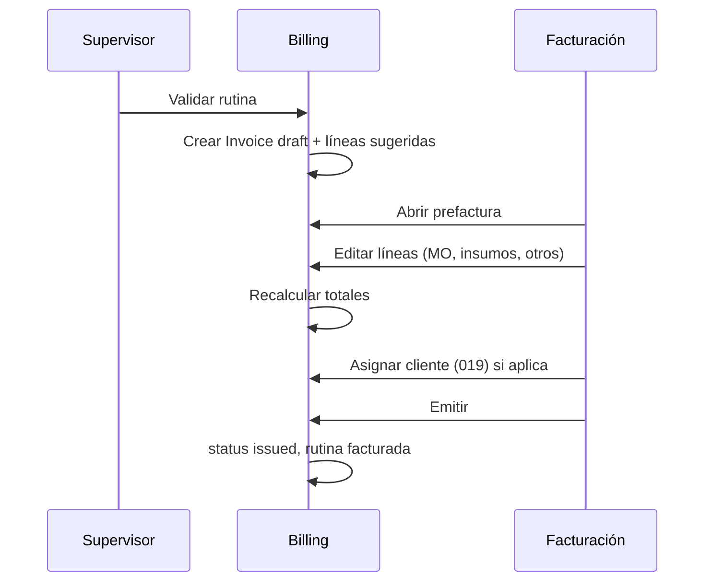

# 020 — Prefactura editable (mano de obra e insumos por documento)

## Problema

Hoy, al **validar** una rutina, `InvoiceDraftService` genera un borrador **cerrado en la práctica**:

- **Mano de obra**: una sola línea derivada de `duration_minutes × tarifa_hora` a nivel **empresa** ([BILLING.md](../../../docs/BILLING.md)).
- **Insumos**: precios tomados del consumo en ejecución, sin edición posterior en UI.
- No refleja la realidad operativa: distinto personal por trabajo, varios trabajadores en el mismo servicio, precios de refacción negociados **solo para esa factura**, o ausencia de mano de obra en trabajos solo de materiales.

La **tarifa hora en configuración** debe seguir existiendo como **valor por defecto / sugerencia**, no como único cálculo obligatorio.

## Objetivo

Convertir el **borrador de factura** en una **prefactura editable** dentro del módulo Facturación:

1. Cargar líneas sugeridas desde la ejecución validada (insumos + mano de obra sugerida).
2. Permitir **ajustar, agregar y quitar líneas** mientras `status = draft`.
3. **Mano de obra por factura**: una o varias líneas (horas, tarifa, cantidad de personas o conceptos libres).
4. **Insumos**: conservar trazabilidad al consumo pero permitir **cambiar precio unitario (y cantidad si aplica) solo en esta factura** sin alterar catálogo ni la ejecución.
5. Recalcular subtotal, IVA y total en servidor al guardar.
6. **Emitir** solo cuando la prefactura esté revisada (comportamiento actual de `issue`, con validaciones nuevas).

## Conceptos de dominio

| Término UI | Significado |
|------------|-------------|
| **Prefactura** | Borrador (`Invoice` draft) en edición |
| **Línea sugerida** | Generada automáticamente al crear el borrador |
| **Línea manual** | Añadida por facturación (ej. segundo técnico, viáticos) |
| **Tarifa sugerida** | `billing_labor_rate_per_hour` de la empresa al abrir editor |

### Tipos de línea (`InvoiceLine.line_type`)

| Tipo | Origen | Editable en prefactura |
|------|--------|-------------------------|
| `supply` | Consumo de ejecución | Cantidad, `unit_price`, descripción; opcional `source_consumption_id` |
| `labor` | Sugerencia o manual | Horas, tarifa, trabajadores (metadatos), descripción |
| `other` | Manual | Concepto libre (flete, permisos, etc.) |

Campos adicionales propuestos en `invoice_lines`:

- `line_type` (enum)
- `sort_order` (int)
- `source_consumption_id` (nullable FK, solo lectura de trazabilidad)
- `metadata` (JSONB opcional: `workers`, `hours`, `rate_per_hour` para labor)

**Invariante:** líneas de factura **emitida** son inmutables (solo cancelación fiscal futura).

## Flujo



### Generación inicial (sustituye lógica rígida actual)

| Línea | Regla sugerida v1 |
|-------|-------------------|
| Insumo | Por cada consumo: `quantity`, `unit_price` = `unit_cost` de ejecución, `description` = nombre insumo |
| Mano de obra | **Una** línea sugerida si `duration_minutes > 0`: `hours = duration/60`, `rate = tarifa empresa`, `workers = 1`; si tarifa empresa = 0, **no** crear línea MO (usuario puede agregar manualmente) |
| Otros | Ninguno |

## API propuesta

| Método | Ruta | Descripción |
|--------|------|-------------|
| GET | `/billing/invoices/{id}` | Incluye `lines[]` con `line_type`, metadata, `client_id` |
| PUT | `/billing/invoices/{id}/draft` | Reemplaza líneas editables + `client_id`; recalcula totales; solo `draft` |
| POST | `/billing/invoices/{id}/lines` | Añadir línea (alternativa a PUT bulk) |
| DELETE | `/billing/invoices/{id}/lines/{line}` | Quitar línea en draft |

Permisos:

| Acción | Permiso |
|--------|---------|
| Ver prefactura | miembro empresa (como hoy) |
| Editar prefactura | `billing.draft.edit` (nuevo) o ampliar `billing.draft` |
| Emitir | `billing.issue` (sin cambio) |
| Configuración tarifa sugerida | `billing.settings` (sin cambio) |

Asignar `billing.draft.edit` a roles **Facturación** y **Administrador**.

### Cálculo de totales (servicio `InvoiceTotalsCalculator`)

```
line_total = round(quantity * unit_price, 2)  // por línea
subtotal = sum(line_total)
tax_total = round(subtotal * tax_rate, 2)     // tasa de empresa al momento de guardar
total = subtotal + tax_total
```

Persistir `tax_rate` usado en el borrador (`invoices.tax_rate_snapshot`) para no cambiar IVA retroactivamente si la empresa cambia configuración antes de emitir.

## UI (Vue)

- **Detalle de borrador** → modo **Prefactura**:
  - Tabla editable de líneas (tipo, descripción, cant., P.U., importe).
  - Botones: agregar mano de obra, agregar concepto, eliminar línea.
  - Panel lateral o sección: resumen subtotal / IVA / total (tiempo real vía API o recálculo cliente + validación servidor).
  - Selector **cliente** (019) antes de emitir.
- Facturas **emitidas**: solo lectura (como hoy).
- Configuración empresa: renombrar ayuda a “Tarifa sugerida de mano de obra (prefactura)”.

## Migración desde comportamiento actual

1. Borradores ya existentes: una migración de datos opcional que marca `line_type` en líneas actuales (`supply` vs `labor` por heurística de descripción).
2. `InvoiceDraftService` pasa a **solo** crear sugerencias; edición vía nuevo servicio `InvoiceDraftEditor`.
3. Tests unitarios de totales + feature de edición y 403 si `issued`.

## Criterios de aceptación

1. Usuario facturación puede cambiar precio unitario de un insumo en el borrador sin modificar `supply_items.standard_cost` ni `execution_consumptions.unit_cost`.
2. Puede agregar dos líneas de mano de obra con distintas tarifas/horas en la misma factura.
3. Emitir con total coherente con suma de líneas + IVA snapshot.
4. No se puede editar líneas tras `issue`.
5. Tarifa en **Configuración** prellena nuevas líneas MO sugeridas, no recalcula automáticamente borradores ya guardados.

## Fuera de alcance v1

- Aprobación workflow de prefactura (segundo firmante).
- Descuentos globales por porcentaje (solo líneas).
- PAC / XML fiscal.
- Actualizar ejecución de rutina desde la prefactura.

## Relación con otras propuestas

- **019**: cliente en prefactura antes de emitir.
- **016**: configuración IVA/tarifa sugerida se mantiene; cambia el **uso** de la tarifa.

## Documentación

- Actualizar `docs/BILLING.md` (flujo prefactura, permisos).
- `openspec/domain/billing.md` — estados y `InvoiceLine`.
