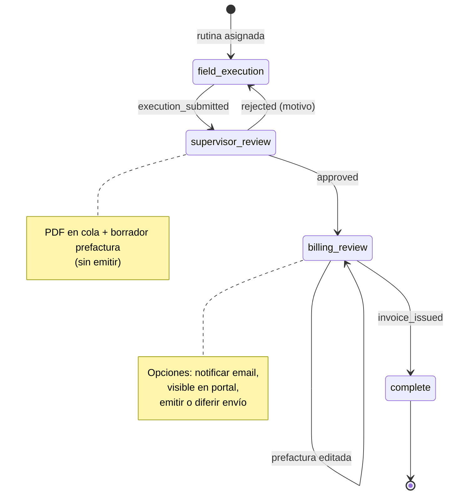

# 032 — Ciclo de vida de rutina, facturación en workflow, portal cliente y trazabilidad

## Problema

El flujo operativo actual (005/031) cierra la rutina en **validación supervisor** con generación de PDF y borrador de factura en el mismo paso (`routine_validated` → `complete`). Eso mezcla **calidad operativa** con **emisión comercial**, no modela el paso explícito de **prefactura / emisión** ni las decisiones de **notificación al cliente**.

Además:

- No existe **perfil cliente** con acceso restringido a facturas y rutinas de *sus* equipos.
- El catálogo de activos no expone **vinculación cliente ↔ equipo por número de serie** de forma operativa en UI.
- La **auditoría** registra eventos sueltos sin un **identificador de correlación** que agrupe todo el ciclo de una rutina.
- El **seed demo** crea una rutina de ejemplo fija; se prefiere **generación bajo demanda** (solo administrador) con datos e imágenes sintéticas para pruebas rápidas.

Referencias: [workflows.md](../../domain/workflows.md), [ADR-011](../../decisions/ADR-011-rbac-spatie-teams.md), cambios archivados 005, 016, 020, 031.

## Objetivo

1. **Workflow por defecto v2** alineado al negocio: ejecución técnico → validación supervisor/admin → (rechazo con motivo y reenvío) → **facturación** (prefactura, emisión, opciones de email) → cierre.
2. **Trazabilidad**: todas las acciones relevantes del ciclo comparten un **`correlation_id`** (batch de auditoría) anclado a la rutina / instancia de workflow.
3. **Portal cliente** (solo lectura): facturas autorizadas para su visualización, descarga, rutinas e historial por equipo vinculado por serie.
4. **Equipos**: catálogo maestro + UI para **vincular activo a cliente** validando **número de serie**.
5. **Demo operativo**: quitar rutina sembrada; **「Generar rutina demo」** en alta de rutina (solo admin).

## Flujo objetivo (workflow v2)

### Responsables por paso

| Paso | Quién | Permisos / rol |
|------|--------|----------------|
| `field_execution` | Técnico | Ejecutar rutina, reenviar tras rechazo |
| `supervisor_review` | Supervisor o Administrador | Validar / rechazar con motivo |
| `billing_review` | Facturación o Administrador | Editar prefactura, cliente, flags de entrega, emitir |
| `complete` | Sistema | Rutina cerrada; factura emitida o ciclo documentado |

### Estados de rutina (`RoutineStatus`)

Añadir o reutilizar de forma coherente:

- Tras envío: `pending_validation` (existente).
- Tras rechazo: `assigned` o `rejected` + instancia en `field_execution` (comportamiento actual ampliado con motivo visible).
- Tras aprobación supervisor: **`pending_billing`** (nuevo) — PDF/reporte en curso, borrador factura listo para ajuste.
- Tras emisión: `invoiced` + workflow en `complete`.

## Modelo de dominio (nuevos / cambios)

### Workflow

- Actualizar `WorkflowRuntime::defaultDefinition()` y validador 031: paso `billing_review`, transición `approved` → `billing_review` (acciones: `routine_validated` sin cerrar), trigger `invoice_issued` → `complete`.
- Layout por defecto con 4 nodos en canvas (031 UI sigue solo lectura de aristas; migración de definiciones existentes vía comando o re-seed documentado).

### Factura (`Invoice` + emisión)

Campos propuestos (nombres orientativos):

| Campo | Uso |
|--------|-----|
| `notify_client_on_issue` | Si al emitir se dispara email al `billing_email` del cliente |
| `client_portal_visible` | Si el cliente puede ver/descargar en portal (independiente del email) |
| `delivery_deferred` | «Más adelante enviar» — persiste intención sin enviar ahora |
| `delivered_to_client_at` | Marca de entrega efectiva (email o habilitación portal) |

La emisión (`POST …/issue`) debe persistir flags elegidos en UI de prefactura; jobs de email **idempotentes** y auditados con el mismo `correlation_id`.

### Auditoría

- Migración: `audit_entries.correlation_id` (UUID, indexado, nullable para eventos legacy).
- Al crear `WorkflowInstance` / rutina operativa: generar `correlation_id` y guardarlo en `workflow_instances.correlation_id` (o `routines.audit_correlation_id`).
- `AuditLogger::fromRequest` y listeners (`RoutineValidated`, emisión, transiciones workflow, rechazo) aceptan/propagan `correlation_id`.
- API auditoría: filtro `?correlation_id=` para ver **batch** completo de una rutina.

### Cliente ↔ activo (agnóstico al catálogo)

- Tabla **`asset_client_assignments`**: `company_id`, `asset_id`, `client_id`, `serial_number` (copia al vincular), `assigned_at`, `assigned_by_user_id`, `notes`, opcional `unassigned_at`.
- Regla: al vincular, `serial_number` debe coinverir con `assets.serial_number` (normalización: trim, case).
- Un activo puede tener **un cliente activo** a la vez (v1); histórico de asignaciones para auditoría.
- UI en **Equipos / Activos**: acción «Vincular cliente» (modal: cliente + confirmación de serie).

### Portal cliente (identidad)

**Decisión propuesta (documentar en ADR-012):**

- Rol de membresía **`client`** (o `client_portal`) en `MembershipRole` + permisos Spatie dedicados (`portal.invoices.view`, `portal.routines.view`, sin acceso a módulos internos).
- Usuario vinculado a **un `client_id`** por empresa (`company_memberships.client_id` nullable).
- Login igual (Sanctum); `GET /auth/me` expone `client_id` y módulos solo portal.
- Rutas API bajo prefijo **`/api/v1/portal/…`** con middleware que fuerza `client_id` y **scoping** estricto (nunca listar por `company_id` solo).

### Visibilidad de datos para cliente

- **Facturas**: solo `status = issued` y `client_portal_visible = true` y `client_id` = cliente del usuario.
- **Rutinas**: rutinas cuyo `asset_id` tenga asignación activa al `client_id`; incluir historial de ejecuciones, reporte PDF si política lo permite, enlace a factura si visible.
- **Descarga**: `GET /portal/invoices/{id}/download` (PDF emitido o documento fiscal placeholder v1); política de autorización + audit `portal.invoice_downloaded`.

## Alcance por fases (entregables)

### Fase A — Workflow v2 + estados + auditoría correlacionada

- Definición JSON por defecto y migración de instancias en curso (solo pasos compatibles).
- `WorkflowRuntime`: triggers `invoice_issued`, paso `billing_review`; supervisor ya no transiciona a `complete`.
- `RoutineStatus::PendingBilling`; pantallas rutina/facturación reflejan paso actual.
- `correlation_id` en instancia + auditoría; tests Feature transición completa.

### Fase B — Facturación en el flujo

- UI prefactura (020): panel pre-emisión — notificar email, visible en portal, diferir envío.
- Emitir solo desde paso workflow correcto (o `pending_billing` + permiso `billing.issue`).
- Listener email opcional al emitir; cola + plantilla mínima.
- Workflow designer: actualizar textos de ayuda / toggle acciones (031).

### Fase C — Vinculación equipo–cliente

- Migración + API CRUD asignaciones + UI activos.
- Validaciones serie; tests.

### Fase D — Portal cliente (web)

- Rol, permisos, seed usuario demo cliente.
- Shell Vue reducido: facturas (lista + descarga), equipos vinculados, rutina detalle/historial.
- Sin acceso a diseño, catálogos internos ni otras empresas.

### Fase E — Rutina demo bajo demanda

- Eliminar creación de `Routine` en `PhoenixDemoSeeder` (mantener tipos, activo, workflow).
- `POST /routines/demo` (admin): rutina nueva con respuestas fake, consumos opcionales, imágenes placeholder (generadas en storage local).
- UI «Generar rutina demo» en `RoutinesPage` solo si administrador.

## Mejoras transversales (recomendadas en implementación)

| Área | Mejora |
|------|--------|
| **Seguridad** | Policies dedicadas portal; IDs enumerables mitigados con 404 homogéneo; rate limit descargas |
| **UX** | Timeline en detalle rutina: workflow + auditoría filtrada por `correlation_id` |
| **UX rechazo** | Motivo obligatorio visible al técnico en re-ejecución |
| **Email** | Si `notify_client_on_issue` y sin `billing_email`, bloquear emisión o warning explícito |
| **PDF cliente** | Misma regla que factura: solo si `client_portal_visible` o envío explícito |
| **Demo** | Marcar rutinas demo (`routines.is_demo`) para excluir de métricas dashboard opcional |
| **Migración** | Comando `phoenix:migrate-workflow-definitions-v2` para empresas con definición v1 |

## Fuera de alcance (esta propuesta)

- PAC / XML fiscal México u otro país.
- App móvil cliente (solo web portal).
- Múltiples clientes simultáneos por activo (v2).
- Editor de grafo workflow (sigue 031).
- SSO cliente externo (password + Sanctum v1).

## Criterios de aceptación

1. Flujo demo admin: generar rutina demo → enviar → validar → ajustar prefactura → emitir con flags → rutina `invoiced` y workflow `complete`.
2. Rechazo supervisor devuelve al técnico; reenvío vuelve a validación; eventos auditados comparten `correlation_id`.
3. Usuario portal cliente ve solo facturas marcadas `client_portal_visible` y rutinas de activos vinculados por serie.
4. Descarga de factura funciona y deja rastro en auditoría.
5. Seed demo **no** crea rutina; documentación `DEMO_ENV` y pruebas manuales actualizadas.
6. Tests Feature cubren workflow v2, portal scoping y vínculo serie–cliente.

## Riesgos

| Riesgo | Mitigación |
|--------|------------|
| Rutinas en vuelo con workflow v1 | Comando migración + mapeo de `current_step_key` |
| Confusión rol facturación vs supervisor | Estados UI + permisos en endpoints de transición |
| Fuga de datos entre clientes | Tests negativos portal; queries siempre por `client_id` |
| Imágenes demo pesadas | Placeholders SVG/1×1 JPEG en generador |

## Documentación a actualizar

- `openspec/domain/workflows.md`, glosario (**Cliente portal**, **Asignación equipo–cliente**, **Correlación de auditoría**).
- **ADR-012** — Identidad y permisos portal cliente.
- **ADR-013** — Correlación de auditoría por ciclo de rutina (opcional si ADR-012 basta).
- `docs/BILLING.md`, `docs/PRUEBAS_MANUALES.md`, `docs/DEMO_ENV.md`.

## Dependencias

- Implementación base 031 (validador, diseñador) — cerrada o en paralelo.
- Prefactura editable 020 — extender campos de entrega.
