# Arquitectura de información — Web Phoenix

Navegación principal de la aplicación administrativa (Vue SPA). Iconografía y labels finales en implementación.

## Estructura de primer nivel

```mermaid
flowchart TB
  Home[Inicio / Dashboard]
  Ops[Operación]
  Cat[Catálogos]
  Design[Diseño]
  Money[Facturación]
  Admin[Administración]

  Home --> KPIs[Resumen: pendientes validación, servicios hoy]

  Ops --> Servicios[Lista de servicios]
  Ops --> Activos[Activos por sitio]
  Ops --> Costos[Costos por período]

  Cat --> Equipos[Catálogo de equipos]
  Cat --> Insumos[Insumos y stock]
  Cat --> Proveedores[Proveedores]

  Design --> TiposR[Tipo de servicio]
  Design --> Formularios[Formularios]
  Design --> Reportes[Plantillas de reporte]
  Design --> Flujos[Workflows]
  Design --> Prompts[Prompts IA]

  Money --> Borradores[Borradores]
  Money --> Facturas[Facturas emitidas]

  Admin --> Empresa[Empresa y sitios]
  Admin --> Usuarios[Usuarios y roles]
  Admin --> Auditoría[Auditoría]
  Admin --> Integraciones[Integraciones - futuro]
```

## Mapeo a módulos backend

| Área UI | Módulos |
|---------|---------|
| Operación | Maintenance, Assets, Inventory |
| Catálogos | Catalogs, Inventory |
| Diseño | Dynamic Forms, Dynamic Reports, Workflow, AI Gateway |
| Facturación | Billing |
| Administración | Companies, Identity, Audit |

## Pantallas críticas (MVP)

| Pantalla | Usuario | Objetivo |
|----------|---------|----------|
| Lista servicios + filtros | Supervisor, Admin | Ver estado y abrir detalle |
| Detalle servicio / ejecución | Supervisor | Validar, ver evidencias, texto IA |
| Editor tipo de servicio | Admin | Enlazar form + reporte + workflow |
| Diseñador de reporte | Admin | WYSIWYG componentes → PDF |
| Catálogo activos | Admin | CRUD activo + sitio |
| Borrador factura | Facturación | Completar y emitir |

## Rutas (convención propuesta)

Prefijo `/app` tras login:

- `/app/dashboard`
- `/app/routines`, `/app/routines/:id`
- `/app/assets`, `/app/catalog/...`
- `/app/design/routine-types`, `/app/design/forms/:id`, `/app/design/reports/:id`
- `/app/billing/drafts`, `/app/billing/invoices`
- `/app/settings/...`

## Fase 2

No duplicar en web la captura pesada de fotos; web es **validación y configuración**. Captura principal en móvil.
