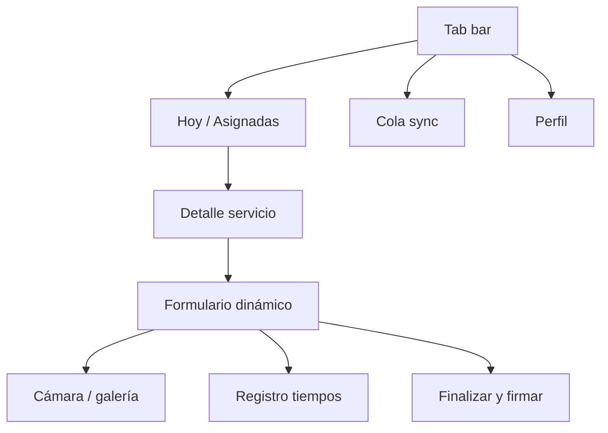

# App de campo — Phoenix (diseño)

Fase 2 — Flutter. Referencia arquitectónica: [mobile-sync.md](../architecture/mobile-sync.md).

## Navegación móvil

## Pantallas

| Pantalla | Contenido |
|----------|-----------|
| Lista “Hoy” | Servicios asignados, badge offline/sync/error |
| Detalle | Activo, sitio, tipo, instrucciones |
| Formulario | Render desde definición JSON (mismos tipos que web) |
| Cámara | Compresión ligera, cola de subida |
| Finalizar | Resumen + firma + confirmación local |
| Cola sync | Eventos pendientes, reintentar, último error |

## Offline

- SQLite: servicios, respuestas, eventos outbox, catálogos cacheados.
- Indicador global: verde (sync OK), amarillo (pendiente), rojo (error persistente).
- Finalizar servicio **nunca** bloqueado por red.

## Tiempos

- Cronómetro opcional por servicio o por tarea (configurable en tipo de servicio).
- Persistir duración en ejecución para costos.

## Seguridad

- PIN o biometría opcional al abrir app (empresa configurable).
- Logout revoca token y limpia datos sensibles según política.

## Diferencias con web

| Capacidad | Web | Móvil |
|-----------|-----|-------|
| Diseñar formularios | Sí | No |
| Ejecutar servicio | Sí (limitado) | Sí (principal) |
| Validar | Sí | No (v1) |
| Facturar | Sí | No |
