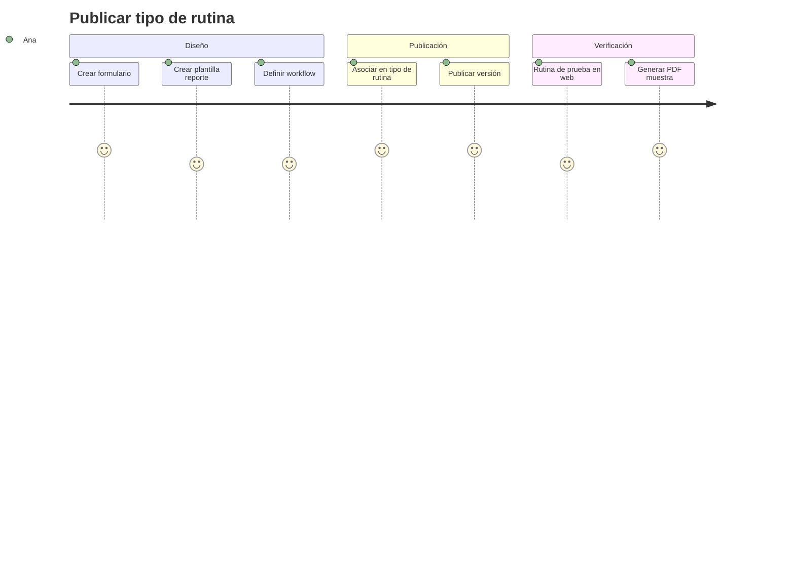

# Personas y journeys — Noah

## Personas

### Ana — Administradora de operaciones

- Configura catálogos, tipos de rutina, plantillas PDF y permisos.
- Frustración actual: cada cliente pide un formato distinto y requiere desarrollo.
- Éxito en Noah: publica un nuevo tipo de servicio en horas, no semanas.

### Luis — Técnico de campo

- Ejecuta rutinas preventivas y correctivas; poca paciencia con formularios largos.
- Trabaja en sitios con mala señal.
- Éxito: termina rutina, ve “guardado local / sincronizado”, sigue al siguiente sitio.

### Patricia — Supervisora

- Revisa evidencias y redacción antes de enviar al cliente.
- Necesita cola “pendiente de validación” y diff entre comentario original y texto IA.
- Éxito: aprueba en lote o una a una con trazabilidad.

### Roberto — Facturación

- Convierte trabajos validados en facturas; no debe re-capturar datos de campo.
- Éxito: borrador prellenado desde rutina validada; emite y adjunta reporte PDF.

---

## Journey 1 — Publicar un nuevo tipo de servicio (Ana)

## Journey 2 — Rutina en campo (Luis) — Fase móvil

1. Descarga rutinas asignadas y definiciones de formulario (Wi‑Fi en base).
2. En sitio: inicia rutina → captura fotos, tiempos, comentarios → firma.
3. Guarda (siempre éxito local).
4. Sync automático al recuperar red; estado visible en lista.
5. Si error servidor: reintento en cola sin perder datos.

## Journey 3 — Validar y entregar (Patricia + Roberto)

1. Patricia abre rutina `Pendiente validación`.
2. Revisa galería, tiempos, costos de insumos; compara texto original vs. corregido por IA.
3. Aprueba → workflow dispara generación de PDF y borrador de factura.
4. Roberto revisa borrador, ajusta si aplica, emite factura y envía paquete al cliente (email futuro).

---

## Estados de rutina (UX)

| Estado | Color sugerido | Quién actúa |
|--------|----------------|-------------|
| Borrador | Neutro | Admin |
| Asignada | Info | Técnico |
| En ejecución | Info | Técnico |
| Pendiente sync | Advertencia | Sistema / técnico |
| Pendiente validación | Advertencia | Supervisor |
| Rechazada | Error | Técnico corrige |
| Validada | Éxito | Facturación |
| Facturada | Éxito | — |

Definición formal de máquina de estados en `domain/maintenance.md` (pendiente implementación).
