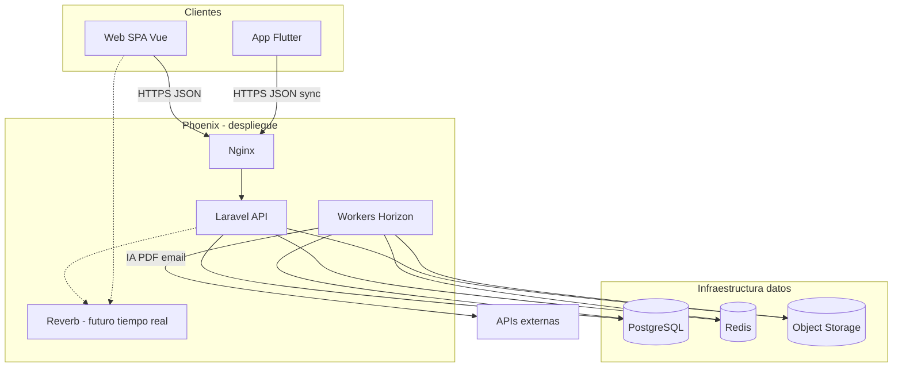

# Contenedores — Phoenix

Vista C4 **nivel 2**: aplicaciones y servicios en runtime.

## Responsabilidades

| Contenedor | Rol |
|------------|-----|
| Web SPA | Admin, diseño, validación, facturación |
| Flutter | Captura offline, sync |
| Laravel API | Dominio, motores, auth, REST |
| Workers | PDF, IA, notificaciones, jobs pesados |
| PostgreSQL | Transaccional + JSONB metadatos |
| Redis | Colas, cache, sesiones |
| Object storage | Fotos, PDFs, logos |

Detalle: [architecture.md](../architecture/architecture.md), [docker.md](../infrastructure/docker.md).
