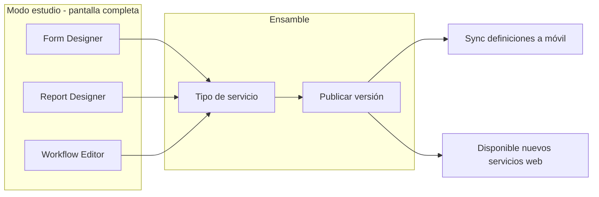

# Flujo estudio de configuración — Phoenix

Cómo el **administrador** arma un tipo de servicio (diseño UX).

## Orden recomendado en UI (onboarding)

1. Catálogo de activos/insumos mínimo.
2. Formulario (qué se captura).
3. Plantilla de reporte (cómo se imprime).
4. Workflow (qué pasa al terminar y al validar).
5. Tipo de servicio + prueba con servicio de ejemplo.

Wireframes: [form-designer.md](../design/form-designer.md), [report-designer.md](../design/report-designer.md).
