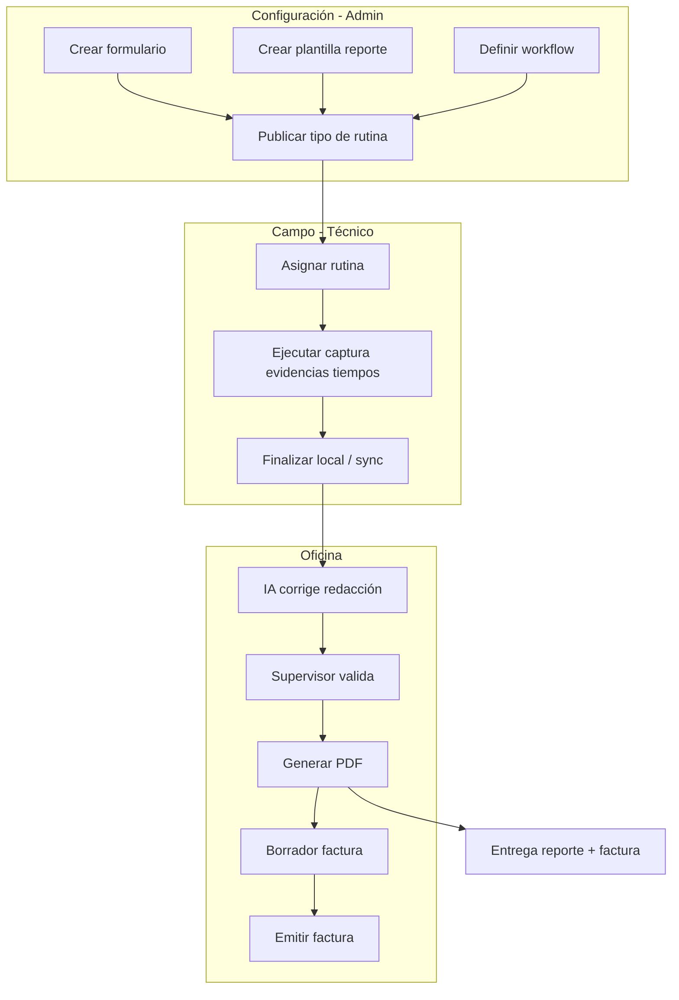

# Flujo end-to-end — Noah

Desde configuración hasta entrega al cliente (visión objetivo completa).

## Notas por fase

| Tramo | Fase roadmap |
|-------|----------------|
| Config + web sin móvil | 1–2 |
| IA gramatical + workflow | 2 |
| Móvil offline + sync | 3 |
| Entrega fiscal real | 2+ según adaptador país |

Journey detallado: [personas-and-journeys.md](../design/personas-and-journeys.md).
