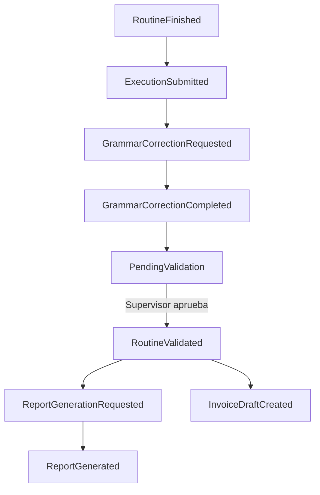

# Diagrama — Flujo de eventos (Phoenix)

Flujo típico post-campo hasta factura. Detalle: [domain-events.md](../architecture/domain-events.md).

Los pasos exactos los define el **Workflow** por tipo de rutina.
