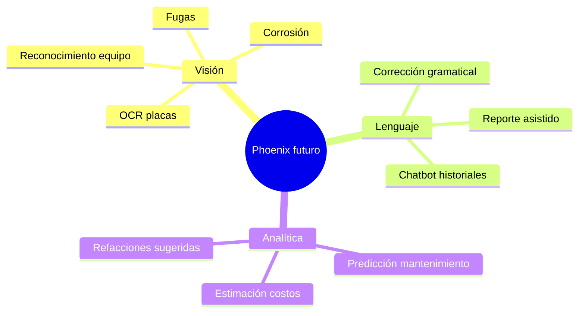
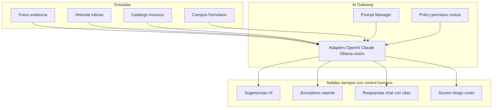

# Capacidades futuras IA y visión — Phoenix

```mermaid
mindmap
  root((Phoenix futuro))
    Visión
      OCR placas
      Reconocimiento equipo
      Fugas
      Corrosión
    Lenguaje
      Corrección gramatical
      Reporte asistido
      Chatbot historiales
    Analítica
      Predicción mantenimiento
      Estimación costos
      Refacciones sugeridas
```

```mermaid
flowchart TB
  subgraph inputs [Entradas]
    IMG[Fotos evidencia]
    HIST[Historial rutinas]
    CAT[Catálogo insumos]
    FORM[Campos formulario]
  end

  subgraph gateway [AI Gateway]
    PM[Prompt Manager]
    PV[Policy permisos costos]
    AD[Adapters OpenAI Claude Ollama visión]
  end

  subgraph outputs [Salidas siempre con control humano]
    SUG[Sugerencias UI]
    DRAFT[Borradores reporte]
    ANS[Respuestas chat con citas]
    SCORE[Scores riesgo costo]
  end

  IMG --> AD
  HIST --> AD
  CAT --> AD
  FORM --> AD
  PM --> AD
  PV --> AD
  AD --> SUG
  AD --> DRAFT
  AD --> ANS
  AD --> SCORE
```

Catálogo y fases: [future-capabilities.md](../vision/future-capabilities.md).
