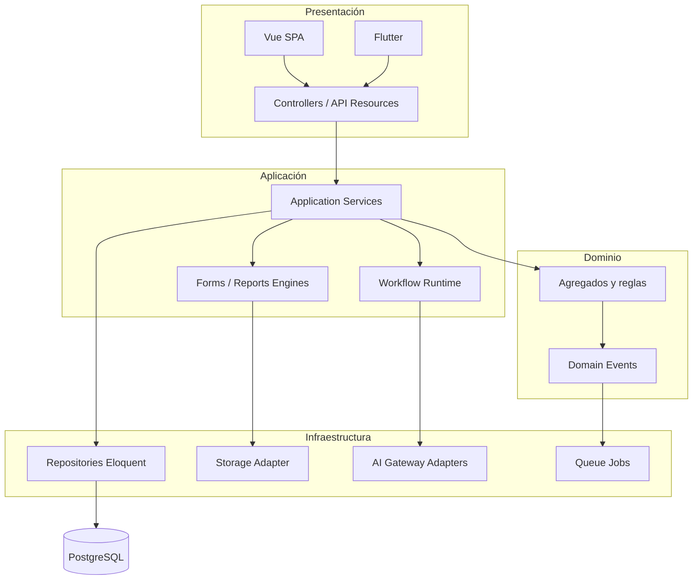

# Arquitectura por capas — Noah

Monolito modular Laravel; fronteras lógicas.

## Reglas

- Dominio **no** importa SDK de LLM ni S3 directo.
- Efectos secundarios (PDF, email, fiscal) vía **eventos + colas**.
- Motores leen **metadatos** versionados, no tablas por tipo de cliente.

ADR: [ADR-001](../decisions/ADR-001-modular-monolith.md), [ADR-006](../decisions/ADR-006-metadata-driven.md).
