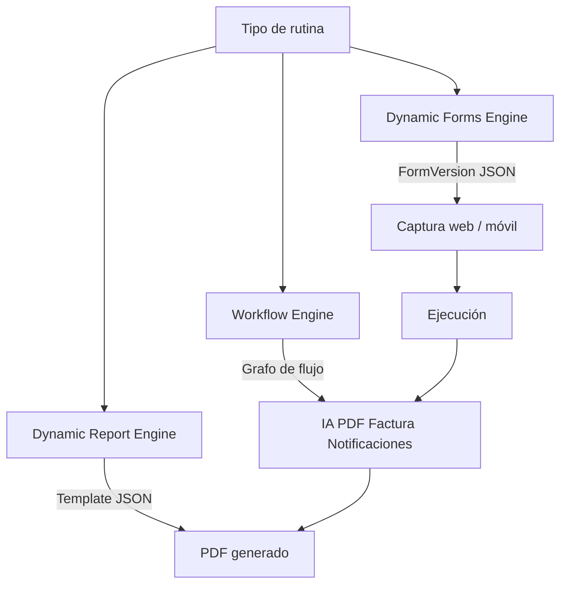

# Tres motores de metadatos — Noah

Núcleo configurable de Noah.

| Motor | Pregunta | Artefacto |
|-------|----------|-----------|
| Forms | ¿Qué datos? | FormVersion |
| Reports | ¿Cómo se ve el entregable? | ReportTemplateVersion |
| Workflow | ¿Qué ocurre después? | WorkflowDefinition |

Sin estos tres, cada cliente nuevo implicaría código nuevo — contrario a [ADR-006](../decisions/ADR-006-metadata-driven.md).
