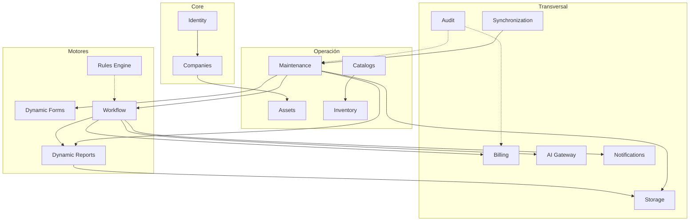

# Diagrama — Mapa de módulos (Phoenix)

Índice de diagramas: [README.md](README.md).

```mermaid
flowchart TB
  subgraph core [Core]
    ID[Identity]
    CO[Companies]
  end

  subgraph ops [Operación]
    AS[Assets]
    CA[Catalogs]
    IN[Inventory]
    MA[Maintenance]
  end

  subgraph engines [Motores]
    DF[Dynamic Forms]
    DR[Dynamic Reports]
    WF[Workflow]
    RE[Rules Engine]
  end

  subgraph cross [Transversal]
    BI[Billing]
    AI[AI Gateway]
    SY[Synchronization]
    ST[Storage]
    NT[Notifications]
    AU[Audit]
  end

  ID --> CO
  CO --> AS
  CA --> IN
  MA --> DF
  MA --> DR
  MA --> WF
  WF --> AI
  WF --> BI
  WF --> DR
  WF --> NT
  MA --> ST
  DR --> ST
  SY --> MA
  RE -.-> WF
  AU -.-> MA
  AU -.-> BI
```

Ver también [context-map.md](../architecture/context-map.md).
