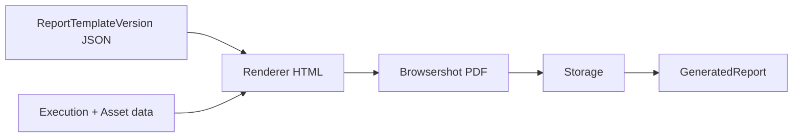

# Diagrama — Report Engine (Noah)

```mermaid
flowchart LR
  T[ReportTemplateVersion JSON]
  D[Execution + Asset data]
  R[Renderer HTML]
  P[Browsershot PDF]
  S[Storage]
  G[GeneratedReport]

  T --> R
  D --> R
  R --> P
  P --> S
  S --> G
```

Componentes y diseñador: [report-engine.md](../architecture/report-engine.md), [report-designer.md](../design/report-designer.md).
