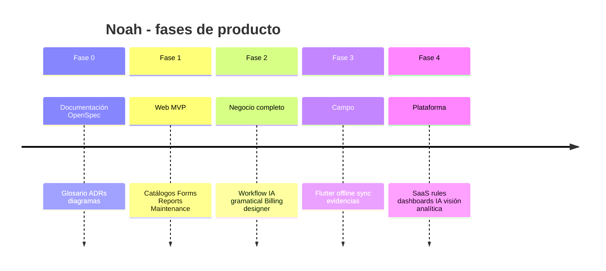
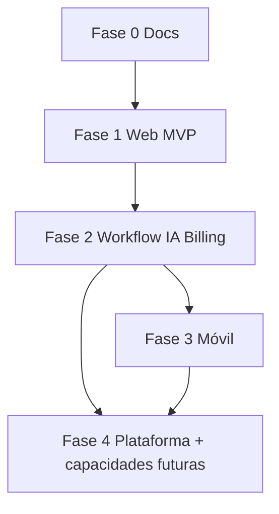

# Roadmap por fases — Noah

```mermaid
timeline
  title Noah - fases de producto
  section Fase 0
    Documentación OpenSpec : Glosario ADRs diagramas
  section Fase 1
    Web MVP : Catálogos Forms Reports Maintenance
  section Fase 2
    Negocio completo : Workflow IA gramatical Billing designer
  section Fase 3
    Campo : Flutter offline sync evidencias
  section Fase 4
    Plataforma : SaaS rules dashboards IA visión analítica
```

```mermaid
flowchart TB
  F0[Fase 0 Docs]
  F1[Fase 1 Web MVP]
  F2[Fase 2 Workflow IA Billing]
  F3[Fase 3 Móvil]
  F4[Fase 4 Plataforma + capacidades futuras]

  F0 --> F1 --> F2
  F2 --> F3
  F2 --> F4
  F3 --> F4
```

Texto: [roadmap.md](../vision/roadmap.md). Capacidades IA/visión fase 4: [future-capabilities.md](../vision/future-capabilities.md).
