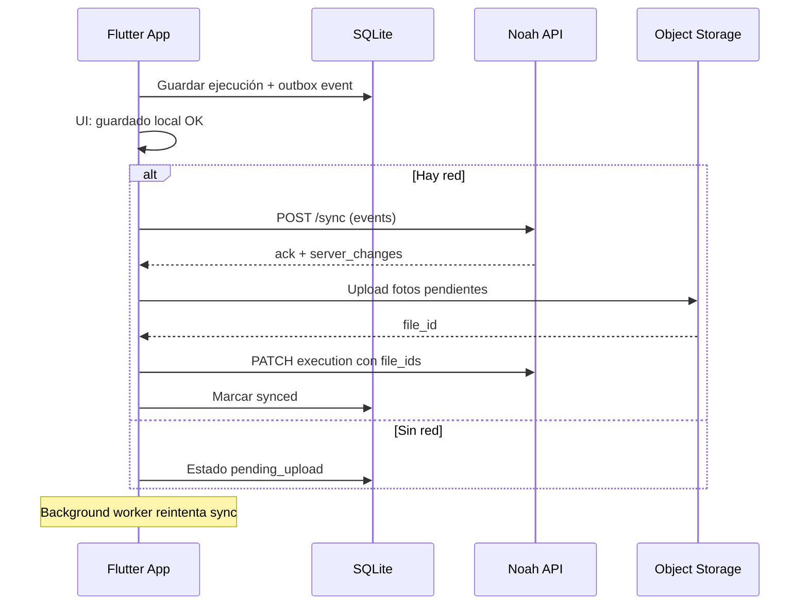

# Diagrama — Sync móvil (Noah)

```mermaid
sequenceDiagram
  participant App as Flutter App
  participant DB as SQLite
  participant API as Noah API
  participant S3 as Object Storage

  App->>DB: Guardar ejecución + outbox event
  App->>App: UI: guardado local OK

  alt Hay red
    App->>API: POST /sync (events)
    API-->>App: ack + server_changes
    App->>S3: Upload fotos pendientes
    S3-->>App: file_id
    App->>API: PATCH execution con file_ids
    App->>DB: Marcar synced
  else Sin red
    App->>DB: Estado pending_upload
  end

  Note over App: Background worker reintenta sync
```

Ver [synchronization.md](../mobile/synchronization.md).
