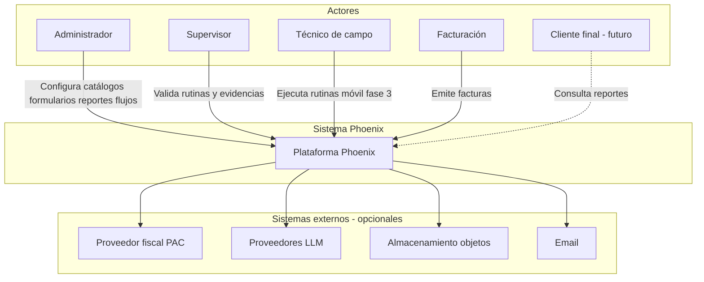

# Contexto del sistema — Phoenix

Vista C4 **nivel 1**: actores y sistema Phoenix.

## Objetivo en una línea

Centralizar **operación de mantenimiento**, **documentación configurable** y **cobro**, con campo offline y IA acotada a asistencia.

Ver [project-intent.md](../vision/project-intent.md).
