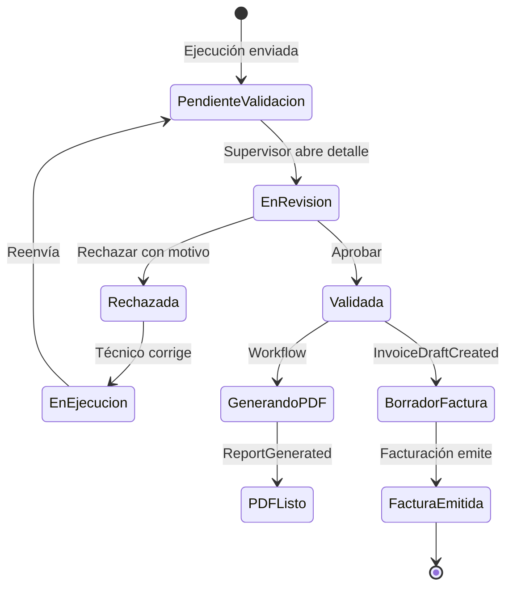
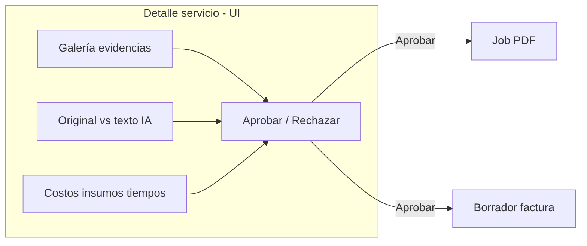

# Flujo validación y facturación — Phoenix

Enfoque **supervisor** y **facturación** (web).

```mermaid
stateDiagram-v2
  [*] --> PendienteValidacion: Ejecución enviada
  PendienteValidacion --> EnRevision: Supervisor abre detalle
  EnRevision --> Rechazada: Rechazar con motivo
  Rechazada --> EnEjecucion: Técnico corrige
  EnEjecucion --> PendienteValidacion: Reenvía
  EnRevision --> Validada: Aprobar
  Validada --> GenerandoPDF: Workflow
  GenerandoPDF --> PDFListo: ReportGenerated
  Validada --> BorradorFactura: InvoiceDraftCreated
  BorradorFactura --> FacturaEmitida: Facturación emite
  FacturaEmitida --> [*]
```

```mermaid
flowchart LR
  subgraph pantalla [Detalle servicio - UI]
    GAL[Galería evidencias]
    TXT[Original vs texto IA]
    CST[Costos insumos tiempos]
    BTN[Aprobar / Rechazar]
  end

  GAL --> BTN
  TXT --> BTN
  CST --> BTN
  BTN -->|Aprobar| PDF[Job PDF]
  BTN -->|Aprobar| INV[Borrador factura]
```

Dominio: [maintenance.md](../domain/maintenance.md), [billing.md](../domain/billing.md).
