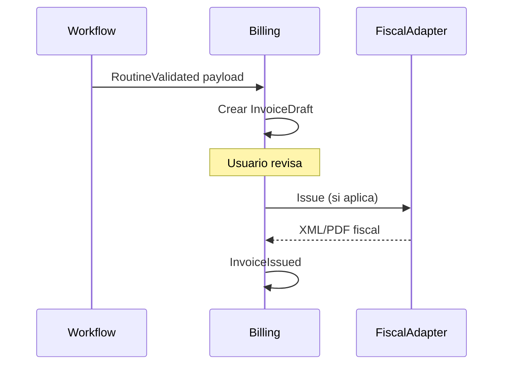

# Dominio — Billing (Phoenix)

## Responsabilidad

Documentos de cobro desacoplados del agregado Routine. Reacciona a eventos de negocio, no consulta tablas de Maintenance directamente.

## Agregados

### Invoice

- `company_id`, cliente (referencia futura o datos embebidos en v1).
- Estado: borrador, emitida, cancelada, error_fiscal.
- Totales, moneda, líneas.
- Referencia externa a servicio/ejecución en metadatos (`source_type`, `source_id`).

### InvoiceLine

- Descripción, cantidad, precio unitario, impuestos (estructura según país).

## Flujo típico

## FiscalAdapter (interfaz)

- `issue(Invoice): FiscalResult`
- `cancel(Invoice): void`
- Implementaciones por país (México PAC/SAT, etc.) en módulo infra, no en dominio Maintenance.

## Invariantes

- No emitir factura sin servicio en estado validado (regla de workflow o dominio Billing).
- Cancelación auditada; no borrado físico.

## Eventos

- `InvoiceDraftCreated`, `InvoiceIssued`, `InvoiceCancelled`, `FiscalIssueFailed`
