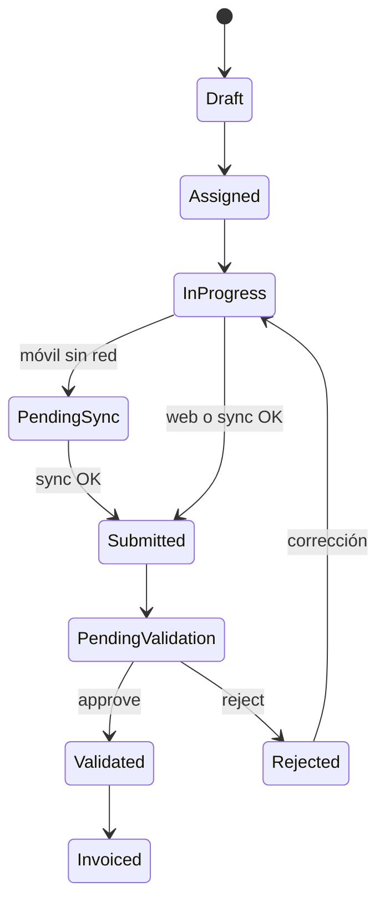

# Dominio — Mantenimiento (Noah)

Borrador de dominio para implementación futura. Términos: [glosario](../glossary/ubiquitous-language.md).

## Agregados

### RoutineType (tipo de rutina)

- Referencias: `form_version_id`, `report_template_version_id`, `workflow_definition_id`.
- Opcional: reglas de costo, prompt IA.
- Publicación inmutable: rutinas nuevas usan versión vigente al crearse.

### Routine

- Pertenece a: empresa, sitio, activo, tipo de rutina.
- Asignación: usuario técnico.
- Estado: ver máquina abajo.

### Execution

- Una rutina puede tener una ejecución activa (o historial de intentos si se rechaza).
- Contiene: respuestas de formulario (JSON), referencias a evidencias, tiempos, texto original y texto post-IA.

## Máquina de estados (borrador)

Ajustes finales al implementar Workflow Engine.

## Relación Rutina vs Orden de trabajo

En MVP, **Rutina** es el agregado principal de operación de campo. **Orden de trabajo** puede ser alias de negocio o entidad de planificación posterior; no duplicar sin necesidad.

## Invariantes

- No validar sin ejecución completa (campos obligatorios).
- No facturar sin estado `Validated`.
- Evidencias obligatorias si el tipo de rutina lo define en metadatos.
