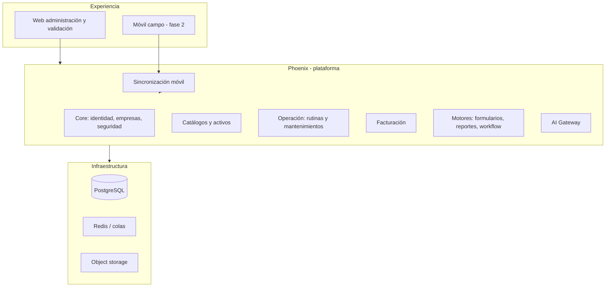
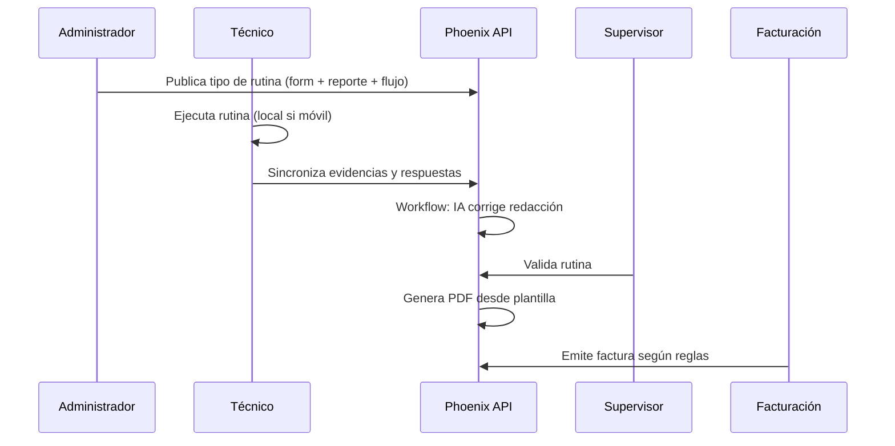

# Conceptualización — Phoenix

Documento central que traduce la intención del producto en un modelo mental coherente. Complementa [product.md](product.md) y [scope.md](scope.md).

## Problema

Las empresas de mantenimiento industrial suelen usar:

- Hojas o PDFs rígidos por tipo de servicio.
- Catálogos desactualizados en Excel.
- Facturación desconectada de la evidencia de campo.
- Reportes que exigen desarrollo cada vez que cambia el formato o la marca del cliente.

**Phoenix** unifica catálogos, operación, documentación configurable y facturación, con captura móvil y validación en oficina.

## Solución en una oración

Una plataforma donde el administrador **diseña** qué se captura (formulario), **cómo se imprime** (reporte) y **qué ocurre después** (workflow), y el técnico **ejecuta** en campo aunque no haya red.

## Capas conceptuales

El **centro** no es solo “mantenimiento”: es **Core + motores configurables**. Mantenimiento es el primer consumidor.

## Los tres motores

| Motor | Pregunta que responde | Salida |
|-------|------------------------|--------|
| **Dynamic Forms** | ¿Qué datos se capturan? | Definición versionada (JSON/metadatos) |
| **Dynamic Reports** | ¿Cómo se presenta al cliente? | Árbol de componentes → PDF |
| **Workflow** | ¿Qué pasos siguen? | Estados, aprobaciones, IA, factura, notificaciones |

Un **tipo de rutina** enlaza: formulario + plantilla de reporte + workflow + (opcional) prompt de IA + reglas de facturación.

## Flujo de valor principal

## Catálogos y costos

- **Equipo / activo**: jerarquía empresa → sitio → activo; vínculo a catálogo de modelos o familias.
- **Insumos**: refacciones y consumibles; stock y costo unitario (inventory).
- **Costo de mantenimiento**: insumos consumidos + mano de obra (tiempos de rutina) + reglas configurables; no mezclar con XML fiscal.

## Reportes dinámicos

Los reportes son **listas de componentes** (título, párrafo ligado a campo, tabla, galería, firma, QR, cabecera, pie con numeración desde página N). El administrador edita en un **diseñador** (paleta | vista previa | propiedades). Persistencia en JSONB; render HTML + PDF vía motor Chromium.

## IA (alcance estricto)

Entrada: comentarios del técnico + instrucciones de prompt registrado.  
Salida: mismo contenido con mejor gramática y claridad; **sin** datos nuevos.  
Toda llamada pasa por [AI Gateway](../architecture/ai-gateway.md) con auditoría y versiones de prompt.

## Facturación

Dominio **separado**: eventos del workflow (p. ej. `RoutineValidated`) disparan creación de borrador de factura. Adaptadores por país (SAT/PAC en México, etc.) detrás de interfaces; el módulo de mantenimiento no conoce XML fiscal.

## Escalabilidad (diseño, no over-engineering)

- Monolito modular Laravel, Docker, PostgreSQL, Redis, colas.
- Escala horizontal posterior (más instancias API, storage externo, PG HA) sin cambiar contratos de dominio.
- Eventos de dominio para desacoplar generación de reportes, notificaciones y facturación.

## Qué hace a Phoenix “producto” y no “proyecto a medida”

Metadatos para nuevos tipos de servicio **sin** nuevos controladores por cliente. La app móvil **descarga** definiciones de formulario. Los reportes y flujos se versionan. Eso habilita SaaS multi-tenant en fases posteriores ([ADR-009](../decisions/ADR-009-multitenancy.md)).

## Documentación visual

- [Diagramas (índice)](../diagrams/README.md)
- [Flujo end-to-end](../diagrams/end-to-end-flow.md)
- [Tres motores de metadatos](../diagrams/metadata-engines.md)

## Intención del producto

Resumen no técnico: [project-intent.md](project-intent.md). Capacidades futuras: [future-capabilities.md](future-capabilities.md).
