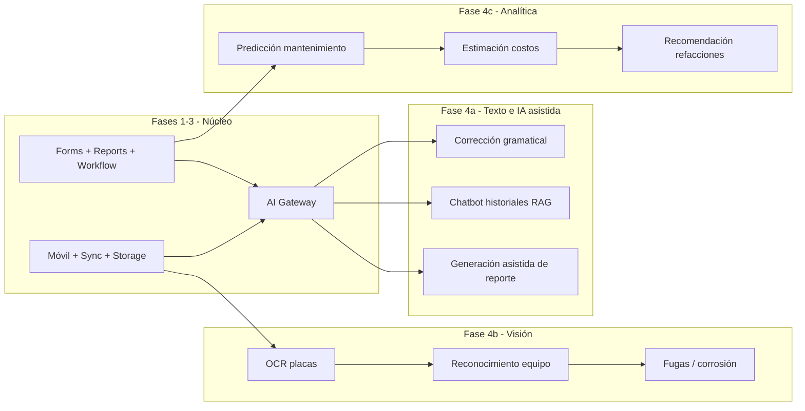

# Capacidades futuras — Phoenix

Funcionalidades **no comprometidas** en fases 1–3. Se habilitan cuando el núcleo (motores, AI Gateway, evidencias en storage, historial de activos) esté estable.

## Catálogo de ideas

| Capacidad | Descripción | Valor |
|-----------|-------------|--------|
| **Reconocimiento de equipo por fotografía** | Sugerir o confirmar activo/catálogo desde foto en campo | Menos errores de etiquetado |
| **Detección de fugas** | Análisis de imagen en evidencias | Alertas tempranas |
| **Detección de corrosión** | Clasificación visual en fotos | Priorización de correctivos |
| **OCR de placas** | Leer serie/modelo desde placa o etiqueta | Captura más rápida |
| **Generación automática del reporte** | Borrador narrativo desde campos + evidencias (con revisión humana) | Menos tiempo de redacción |
| **Chatbot sobre historiales** | Consulta en lenguaje natural sobre servicios y activos (RAG) | Soporte y supervisión |
| ~~**Predicción de mantenimientos**~~ | Implementado en el cambio 046 — ver [domain/predictive.md](../domain/predictive.md) y [ADR-013](../decisions/ADR-013-predictive-maintenance.md) | Planificación preventiva |
| **Estimación de costos** | Proyección según tipo de servicio, insumos y tiempos históricos | Cotizaciones |
| **Recomendaciones de refacciones** | Sugerir insumos según activo, falla o historial | Menos faltantes en campo |

## Fases sugeridas

| Fase | Capacidades | Prerrequisitos |
|------|-------------|----------------|
| **Ya en roadmap cercano** | Corrección gramatical | AI Gateway, prompts, auditoría |
| **4a** | Chatbot historiales, generación asistida de reporte | Índice de documentos/servicios, permisos, revisión obligatoria en workflow |
| **4b** | OCR, reconocimiento equipo, fugas/corrosión | Pipeline de imágenes, modelos o APIs de visión vía Gateway, política de privacidad |
| **4c** | ~~Predicción~~ (hecha), costos, refacciones | Volumen de historial, inventory/costos fiables, gobernanza de modelos |

## Principios (igual que hoy)

1. **Toda IA pasa por AI Gateway** — proveedor intercambiable, prompts versionados, auditoría.
2. **Visión y generación narrativa no sustituyen validación humana** en entregables al cliente.
3. **No inventar hechos** — generación de reporte y chatbot deben citar o enlazar datos del sistema.
4. **Permisos** — chatbot y visión respetan `company_id` y rol.

## Riesgos a diseñar antes de implementar

- Costo por imagen y por token; límites por tenant.
- Sesgo y falsos positivos en detección visual (siempre confirmación humana en v1 de cada capacidad).
- Datos personales en fotos (ofuscación o políticas de retención).

## Relación con roadmap

Ver [roadmap.md](roadmap.md) fase 4; detalle de arquitectura IA en [../architecture/ai-gateway.md](../architecture/ai-gateway.md). Diagrama de visión: [../diagrams/future-ai-vision.md](../diagrams/future-ai-vision.md).
