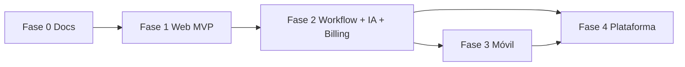

# Roadmap — Phoenix

Roadmap orientativo; las fechas se fijan al iniciar implementación.

## Fase 0 — Fundación documental

- [x] Estructura `openspec/` y nombre Phoenix
- [x] Visión, alcance, concepto, roadmap, negocio, NFR
- [x] Dominio por contexto, arquitectura, motores, API
- [x] Diseño UX, frontend, móvil, infra, prompts, diagramas
- [x] ADRs 001–010
- [x] Flujo de cambios (`openspec/changes/` → `archive/`)
- [x] Plantilla revisión stakeholders (`openspec/glossary/stakeholder-review-2026.md`)

## Fase 1 — Núcleo web (MVP operativo)

**Estado:** **completado** en código (web MVP operativo).

**Objetivo:** operar mantenimientos y reportes desde web sin móvil.

| Entrega | Descripción |
|---------|-------------|
| Identity & Companies | Usuarios, empresas, permisos base |
| Assets & Catalogs | Equipos, insumos, proveedores |
| Forms Engine v1 | Definir campos y versiones; captura web |
| Report Engine v1 | Componentes básicos + PDF |
| Maintenance v1 | Servicio / orden ligada a formulario y activo |
| Inventory & costs | Consumo de insumos y registro de costos |
| Audit básico | Quién cambió qué en entidades críticas |

**No incluye aún:** móvil nativo, facturación fiscal en producción.

## Fase 2 — Flujo de negocio completo (web)

**Estado:** **completado** (workflow, IA gramatical, billing borrador, email, diseñadores MVP).

| Entrega | Descripción |
|---------|-------------|
| Workflow Engine v1 | Validación supervisor, estados |
| AI Gateway v1 | Corrección gramatical en paso de workflow |
| Billing v1 | Borrador de factura; interfaz fiscal abstracta |
| Report designer v1 | UI tipo Canva (MVP) |
| Notifications v1 | Email mínimo |

## Fase 3 — Campo y sincronización

**Estado:** **completado** (app Flutter v0.7 + API sync + evidencias).

| Entrega | Descripción |
|---------|-------------|
| Flutter app | Servicios asignados, captura offline — ver `mobile/README.md` |
| Mobile Sync | `POST /api/v1/sync` eventos idempotentes |
| Storage | Evidencias en disco local; MinIO preparado en compose |

## Fase 4 — Plataforma y capacidades avanzadas

**Estado:** **completado** (webhooks, automatización visual, dashboard configurable, insights RAG, PAC fiscal sandbox/México).

| Entrega | Descripción |
|---------|-------------|
| Webhooks salientes | Suscripciones por evento con firma HMAC + prueba desde UI |
| Automatización | Reglas visuales por disparador (`log`, `webhook`) |
| Dashboard configurable | Preferencias por usuario/empresa |
| Insights IA | Asistente RAG, narrativa, costos, OCR, sugerencias refacciones |
| Integraciones UI | `/app/integrations`, `/app/insights` |
| PAC fiscal | Sandbox + adaptador HTTP México en emisión |

Iteraciones menores futuras: Play Store AAB, reordenar fotos en galería móvil.

## Dependencias entre fases

